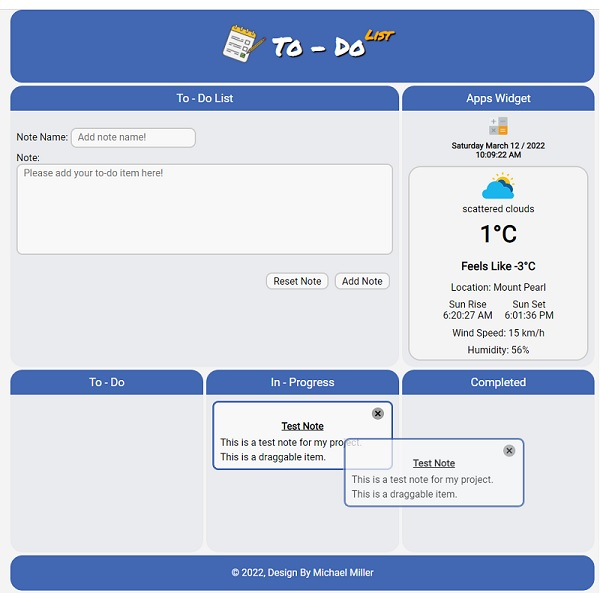

# {Drag & Drop} To-Do Web App

This is my first project as a student of Get Coding. This web app is written with HTML, CSS and Vanilla JavaScript.
This web app allows users to create notes that become draggable from 3 drop areas. Along with the draggable notes, this app also includes the users local weather built with Open Weather API and an app widget area that includes a functional calculator app.

This application was created to create an all in one application that can be used to track daily tasks in my current role as a  project manager, reducing the need for multiple applications.

## 🚀 About Me
I'm currently a student with [Get Coding](http://www.get-coding.ca) completing Full Stack Development.

## Features

- Drag and Drop Function for new notes
- Current weather based on users location with [Open Weather API](https://openweathermap.org/)
- [AXIOS](https://www.npmjs.com/package/axios) use for calling API
- Calculator
- Current date / time included with time change 1 second interval
- Compatiable with mobile devices

## Installation

To use this project locally please install AXIOS via NPM. For a functional weather API the user will also require the creation 
of a config.js file in their local javascript directory and include their API KEY in this file. Please signup for your API key with https://openweathermap.org/

To create your local config.js file.

'use strict';

const config = {
  myapiToken: 'Insert Your API Key Here',
};

## Screenshots

## Demo Site

- [Github Pages](https://millerm30.github.io/todo/)

## Authors

- [@millerm30](https://www.github.com/millerm30)
<h3 align="left">Connect with me:</h3>

## Acknowledgements

Pollyfill DragDropTouch for Android Mobile compatability provided by [Bernardo-Castilho](https://github.com/Bernardo-Castilho/dragdroptouch)

